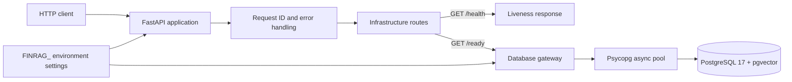

# M1 Architecture

Milestone 1 establishes the execution and quality foundation for FinRAG Agent Platform. It does
not ingest documents or call an LLM.

## Runtime view

The FastAPI lifespan opens and closes the database pool. `/health` performs no external I/O.
`/ready` has a maximum two-second application timeout and confirms both database connectivity and
the presence of the `vector` extension.

## Components and responsibilities

| Component | Responsibility |
|---|---|
| `app/main.py` | Application factory, lifespan, middleware, handlers, and router registration |
| `app/settings.py` | Typed environment configuration and production validation |
| `app/http.py` | Request IDs and safe, uniform public errors |
| `app/security.py` | Bearer API-key dependency for future `/v1` endpoints |
| `app/database.py` | Async Psycopg pool and pgvector readiness probe |
| `app/api/infrastructure.py` | Public liveness and readiness routes |
| `compose.yaml` | Reproducible local API and PostgreSQL services |
| `.github/workflows/ci.yml` | Quality checks and isolated database integration tests |

Direct Psycopg access is intentional for the MVP; an ORM would add abstraction before the data
model exists. Dependency injection at the application factory keeps HTTP and lifecycle behavior
testable without a real database.

## Implemented in M1

- FastAPI startup locally and through Docker Compose;
- public `/health`, `/ready`, `/docs`, and `/openapi.json` endpoints;
- PostgreSQL 17 with pgvector 0.8.6 and persistent local storage;
- typed settings, secret-safe representations, and required production configuration;
- validated request IDs, safe error envelopes, and a Bearer authentication dependency;
- Pytest unit and integration suites, Ruff checks, and GitHub Actions CI;
- non-root API container with runtime-only configuration.

## Explicitly planned, not implemented

- document upload and text extraction;
- structure-aware chunking;
- Google `gemini-embedding-001` embeddings with 768 dimensions;
- vector retrieval and answer generation;
- agent tools, human approval, automated RAG evaluation, observability, and cloud deployment.

The intended API behavior is defined in the [M0 API contract](api-contract-m0.md). Decisions that
affect later milestones are recorded in the [M0 ADR index](adr/README.md).

## Test boundaries

Unit tests use application and database substitutes and require neither Docker nor network access.
Integration tests are marked `integration`, require `FINRAG_RUN_INTEGRATION=1`, and verify the real
PostgreSQL and pgvector readiness path. CI runs these groups in separate jobs so failures clearly
identify whether the problem is application logic or infrastructure integration.
