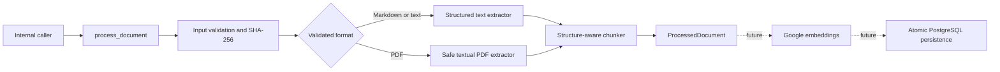

# M2 Document Processing Architecture

Milestone 2 builds the complete local document-processing core while deliberately stopping before
embeddings, application persistence, and HTTP ingestion. This boundary keeps every implemented
claim independently testable without a Gemini key or external service.

## Runtime view

The solid path is implemented. Dashed components are planned and must not be presented as current
functionality.

## Components

| Component | Responsibility |
|---|---|
| `app/ingestion/models.py` | Immutable contracts from untrusted file through processed result |
| `app/ingestion/validation.py` | Byte, filename, type, provenance, metadata, and SHA-256 validation |
| `app/ingestion/text_extraction.py` | UTF-8 Markdown and plain-text structure extraction |
| `app/ingestion/pdf_extraction.py` | Strict page-scoped selectable-text extraction |
| `app/ingestion/chunking.py` | Deterministic page- and section-aware chunking |
| `app/ingestion/processing.py` | Atomic orchestration, deadline, cancellation, and safe logging |
| `scripts/validate_documents.py` | Content-safe local measurement command for public fixtures |
| `tests/fixtures/documents/` | Small fictional inputs committed for reproducible tests |

## Trust boundaries

`ReceivedDocumentFile` and all optional fields are untrusted. Validation happens before a
format-specific parser receives them. Extracted text remains untrusted document content: headings,
frontmatter, HTML, URLs, code, and prompt injection never become application instructions.

`ProcessedDocument` is created only after validation, extraction, and chunking succeed. It keeps
validated provenance and chunks but excludes raw bytes and intermediate page content. No database
row, file, embedding, or background job is produced by this pipeline.

## Determinism and location

- SHA-256 is calculated over the original bytes.
- Markdown sections and PDF physical pages are hard chunk boundaries.
- Chunk indexes start at zero; PDF page indexes start at one.
- The same bytes and fields produce the same result structure and chunks.
- Repeated headings and overlap count toward the 2,400-character chunk maximum.

The processing duration and terminal log timestamp are operational observations and are not part of
the deterministic result.

## Runtime boundaries

The local pipeline performs no network or database I/O. PostgreSQL and pgvector integration tests
in M2 validate the future persistence schema independently; they do not mean processed documents
are currently stored.

The FastAPI OpenAPI schema still exposes only `GET /health` and `GET /ready`. Swagger is available
for those implemented routes, but `POST /v1/documents` and RAG query endpoints do not exist yet.
