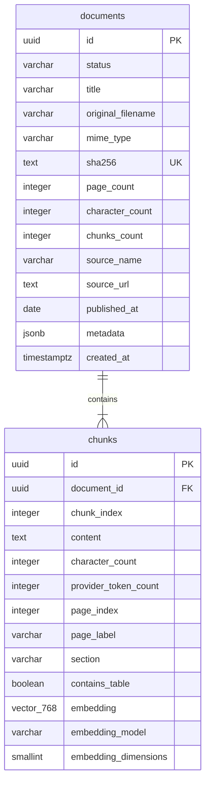

# Document Database Schema

M2-01 defines the relational schema required by the future atomic ingestion operation. It does not
write documents from the application yet.

## Relationship



## Invariants

- UUID values are generated by the application, not by a database default.
- SHA-256 is lowercase hexadecimal and unique across the single MVP corpus.
- Only `indexed` documents can be persisted by the final ingestion transaction.
- A document has at least one chunk and a maximum of 500,000 extracted characters.
- PDF page counts are limited to 50, and chunk page indexes start at 1.
- Chunk indexes start at 0 and are unique within a document.
- Chunk content is non-empty and limited to 2,400 characters.
- Embeddings are non-null `vector(768)` values whose recorded dimension is also fixed at 768.
- Deleting a document removes its chunks through `ON DELETE CASCADE`.
- No HNSW or IVFFlat index is created for the MVP's exact vector search.

The `metadata` column must be a JSON object. Size, key count, reserved names, and allowed value
types will be validated by the application before persistence.

## Applying the migration

The PostgreSQL image runs files from `docker/postgres/init` automatically only when it creates a
new database volume. To upgrade a volume created during M1, start PostgreSQL and apply M2-01 once:

```bash
docker compose up -d --wait postgres
docker compose exec -T postgres psql -v ON_ERROR_STOP=1 -U finrag -d finrag \
  -f /docker-entrypoint-initdb.d/002-create-document-schema.sql
```

The migration is transactional. If a statement fails, PostgreSQL does not keep a partial schema.
Do not rerun an already-applied version; inspect the tables instead:

```bash
docker compose exec postgres psql -U finrag -d finrag -c "\d documents"
docker compose exec postgres psql -U finrag -d finrag -c "\d chunks"
```

Application startup deliberately does not run migrations. This keeps schema changes explicit and
prevents multiple API instances from racing to modify the database.
